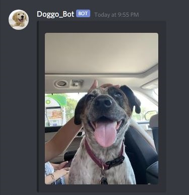

## Doggo Webhook

Looking at dog pictures improves [well-being](https://www.psychologytoday.com/ie/blog/your-online-secrets/202004/looking-pictures-dogs-improves-well-being)! Why not automate this with your IM app (did someone say [Discord](https://discord.com/)?)

[doggo.py](doggo.py) will fetch the top 25 reddit posts on ```/r/dogpictures``` and push a randomly picked iamge it to your text application as a webhook. You can run this on a cronjob to send dog pictures at regular intervals.

### Installation:
```Shell
# Clone
git clone https://github.com/shreyasgaonkar/doggo_webhook.git
cd doggo_webhook/

# Optionally use virtual environment
python -m venv venv
venv\Scripts\activate.bat # Windows
source venv/bin/activate # MacOS

# Deactivate virtual environment
deactivate

# Install dependencies
pip install -r requirements.txt

# Fetch a goodest boi/girl
python doggo.py
```


### Set webhook environment variable:
```Shell
# Windows
set webhook_url="<webhook-endpoint>"

# MacOS
export webhook_url="<webhook-endpoint>"
```

or hard code the value:

```Python
try:
    WEBHOOK_URL = os.environ['webhook_url']
except KeyError:
    WEBHOOK_URL = '<enter-webhook-url>'
```

### See in action:

